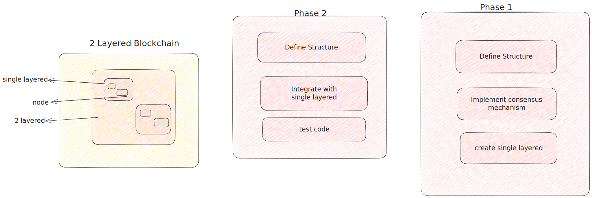

# RusChain

> #### right now in Phase 1

Experimental 2-layered blockchain with rust.



## Getting Started

> Visit [DevDocs](./dev-docs/Readme.md) for more details.

### Installation

to install the project, clone the repository and run the following command:

```bash
cargo build
```

> Also for documentation, run the following command:
>
> ```bash
> cargo doc --open
> ```

### Prerequisites

- [Rust](https://www.rust-lang.org/tools/install)
- [Cargo](https://doc.rust-lang.org/cargo/getting-started/installation.html)

### 2-Layered Blockchain Implementation Roadmap:

- [x] **Setup Initial Codebase**

  - [x] Create a new Rust project using `cargo`.
  - [x] Define the basic project structure.
  - [x] Set up dependencies in the `Cargo.toml` file.

- [x] **Implement Single Node Chain (Layer 1)**

  - [x] Create a basic block structure.
  - [x] Implement Proof of Work (PoW) consensus for Layer 1.
  - [x] Develop functions for adding blocks to the main chain.

- [ ] **Implement Multiple Node Chain (Layer 1)**

  - [ ] Extend the code to handle multiple nodes in Layer 1.
  - [ ] Implement peer-to-peer communication for nodes in Layer 1.

- [ ] **Make Central Chain (Layer 2)**
  - [ ] Create a new module for Layer 2 functionality.
  - [ ] Define a specialized block structure for Layer 2.
  - [ ] Design a consensus mechanism for Layer 2 (e.g., PBFT).
- [ ] **Connect Layer 2 to Layer 1**

  - [ ] Develop a mechanism for Layer 2 to connect with the main chain.
  - [ ] Enable communication between Layer 1 and Layer 2 nodes.
  - [ ] Implement data exchange and confirmation between the layers.

- [ ] **Documentation and Refinement**
  - [ ] Document the code and system architecture.
  - [ ] Refine the code for clarity and maintainability.
  - [ ] Consider adding comments and docstrings where necessary.
